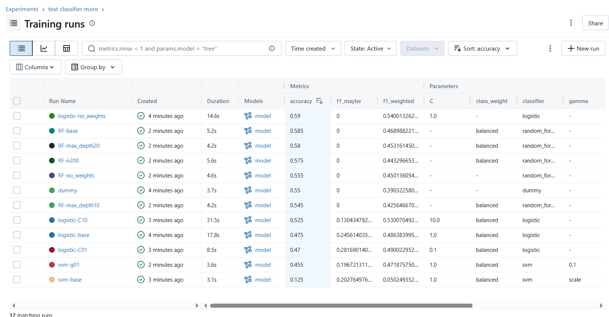

# Medical abstract classifier
> Building a medical abstract classifier using [PubMed](https://pubmedqa.github.io/index.html) data.

  

The main goal of this project is to build something cool whilst learning new tools. Right now my environment is `WSL2` and I'm trying to use regular `.py` scripts instead of `.ipynb` notebooks.  
Some tools I'd like to fiddle with are : *HuggingFace, MLflow, Docker, FastAPI, GitHub Actions.*

## Data

This project utilizes the [labeled PubMedQA](https://huggingface.co/datasets/qiaojin/PubMedQA) dataset, which poses a challenging class imbalance problem. The dataset consists of 552 `yes` samples, 338 `no` samples, and 110 `maybe` samples. To handle it properly, I will stratify the splitting of the data, and will probably tinker with the `class_weight` argument of classifiers, making sure it's set to `balanced`.  
Another important preprocessing step involves *tokenization*. The current tokenizer has a **512** `max_length` limit, enforced via truncation, which means we might throw away meaningful information. A more robust approach would involve chunking longer texts, embedding each segment, and then aggregating these embeddings for the final representation.

## Model

A basic classifier achieves an accuracy of around **50%**, which is better than random but not better than a *dummy* classifier. The `maybe` class is essentially not being learned *(F1 of 0.25)*, likely due to its inherent ambiguity and low prevalence in the data.  

  

> MLflow UI displaying multiple runs for the text classification task with different classifiers and hyperparameters, including baselines.

An interesting finding is that `logistic-no_weights` *(no class_weight balancing)* gets the best accuracy at **0.59** but `f1_maybe` of **0**. This reflects a common precision-recall tradeoff where the model optimizes for overall accuracy by focusing on majority classes while neglecting minority classes.
